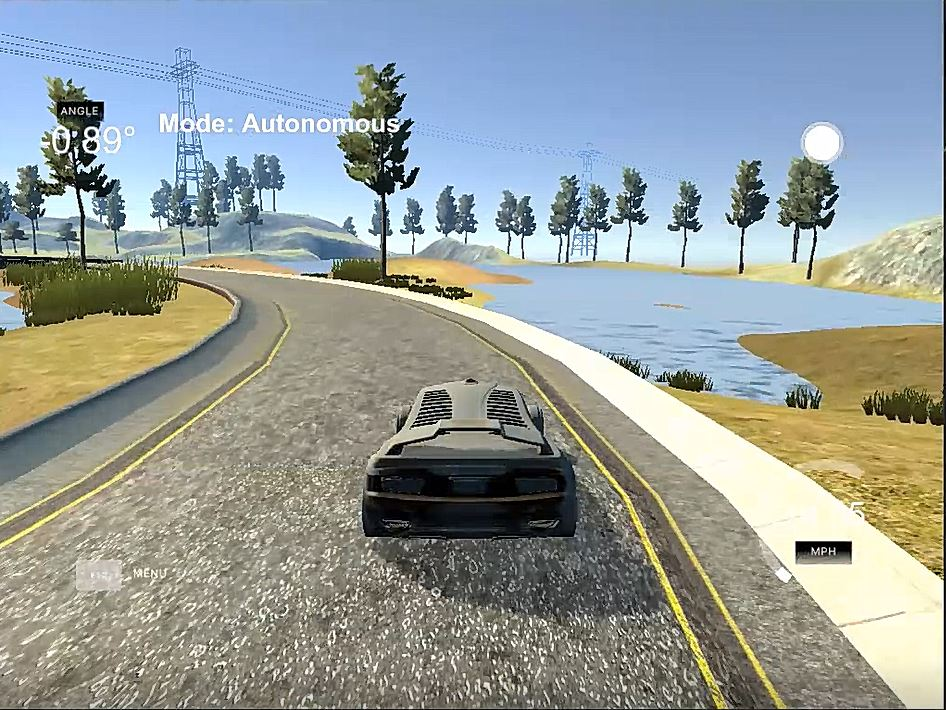
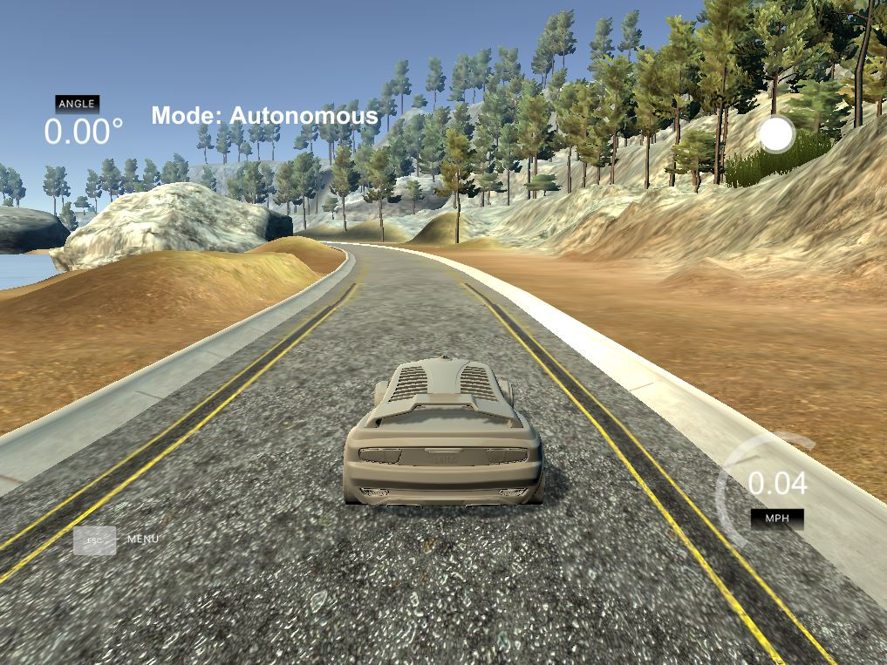

# Project: Steering and Throttle PID Controller

[](http://www.udacity.com/drive)

The PID Controller safely maneuvers the car around the virtual lake racetrack by controlling the car's steering and throttle:



Check out the video from testing the [PID Controller application demo](https://youtu.be/M3-PN9O1mbA).

Overview
---

The purpose of this project was to implement a C++ PID Controller that safely maneuvers the car around a virtual lake racetrack. Testing the PID Controller involved verifying that the car was able to drive for at least 1 lap without any tire leaving the drivable portion of the track surface, popping up onto ledges or roll over any surfaces that would otherwise be considered unsafe if humans were in the vehicle.

Contents
---

- **[src/](src/)**: contains source code for the project
- **[src/main.cpp](src/main.cpp)**: main file is executed after running **./run.sh** shell script. main.cpp acts as a web server that reads crosstrack error and speed data from the simulator client. Then it processes that data to calculate the steering angle and throttle, which is passed as a JSON message to the simulator to control the car's steering and speed.
- **[docs](docs)**: contains images, backup code and research papers
- **[build.sh](build.sh)**: creates build directory, compiles the project into an executable file **pid**
- **[run.sh](run.sh)**: executes the **pid** program
- **[clean.sh](clean.sh)**: removes the build folder and cleans the project
- **[install-ubuntu.sh](install-ubuntu.sh)**: contains bash code to install the tools necessary to run the PID project on linux. This script can be run inside Windows 10 Bash on Ubuntu. There is a similar install script for mac.
- **[CMakeLists.txt](CMakeLists.txt)**: contains directives and instructions describing the project's source files and targets (executable, library, or both). It is a build configuration file that cmake uses to generate makefiles. Then the make command is used to manage compiling the project, use a compiler to compile the program and generate executables. In our case, we retrieve the **pid** executable file, machine language, that runs the c++ program directly on the computer.

Reflection
---

When cloning the [Udacity PID Controller Github Repo](https://github.com/udacity/CarND-PID-Control-Project), this project came with [uWebSocket](https://github.com/uNetworking/uWebSockets) code that has the C++ program act as a web server and read crosstrack error (CTE), speed and steering angle data from the Unity simulator client.

A C++ **PID Controller class** was implemented for use in the **main.cpp** file. This class helped with code readability and easy use for calculating the steering and throttle for the car. One useful resources that helped me in the project included Udacity lesson 12 - PID Control, which focused on learning how to use and implement PID controllers in Python. Outside resources that helped me with simplifying the complexity of the project included referencing other people's approaches to solving the PID Controller problem.

### P, I, D Coefficient Explanation

**P** stands for **proportional** and it controls the error proportionality. Setting only the P control, I have found is aggressive and has oscillations. If P is high, oscillations happen really fast. For example, a high P means the controller is steering really fast or rapid acceleration increase. 

**I** stands for **integral** and it controls the accumulating error. This coefficient is convenient especially when dealing with a bias in the system because it will increase the control signal through integrator summation and drive the error down. If I is high, the number of oscillations increase. For the steering example, a high I increases the number of times the controller steers. For the throttle example, a high I increases how fast the controller goes from 0 to 100 mph.

**D** stands for **derivative** and it controls the rate of change of error. This coefficient reduces oscillation the higher the D value is. For the steering example, a high D decreases how often the controller steers. For the throttle example, a high D decreasaes how fast the controller accelerates.

### PID Controllers in Main Program

In main.cpp, you will find that I created two objects of the PID class: **pid** for steering and **pid_speed** for throttle. With both of these object, I am to control the car's steering angle and speed.

#### Tuning PID Hyperparameters

Next I call on each object's Init() function choosing the PID coefficients carefully since I did not go with twiddle, schochastic gradient descent (SGD) or another approach for automating the tuning of these coefficients with the least error. 

In terms of the **steering PID controller**, I wanted the car to do smooth steering with longer duration in between steering. So, I set the **p coefficient** to `0.10`, so the car's steering does not oscillate too much just enough for smooth steering. I set the **i coefficient** to `0.0001`, allowing the car to steer from one side to the other in longer durations. I set the **d coefficient** to be `1.0` or 10x the p coefficient, so oscillations happen less frequently. My goal with tuning the PID steering coefficients was to create a PID controller that does not steer aggressively. I found that my steering PID controllerr worked well with a throttle PID controller that drove slower on the racetrack.

In terms of the **throttle (speed) PID controller**, I wanted the car to drive faster on the racetrack, but not at the cost of unsafe steering. So, I set the **p coefficient** to `0.1`, so the car's throttle does not oscillate too fast just enough for gradual acceleration increase. I set the **i coefficient** to `0.00015`, so the car accelerates at a slower rate, gradually increasing speed as the car drives on the track. I set the **d coefficient** to `0.0` since increasing d makes the oscillations go away and we want oscillations, so the car can reach higher speeds.

I found tuning the steering and throttle PID coefficients as shown in the table below allowed for safe steering while driving at a speed from 0 to 23 mph:

| PID | Steering | Throttle |
|:---:|:--------:|:--------:|
| Tau_p | 0.10   | 0.1      |
| Tau_i | 0.0001 | 0.00015  |
| Tau_d | 1.0    | 0.0      |

The above PID coefficients is what I used to drive safely around the racetrack for at least 1 lap. 

### Adding Steering and Throttle Computation to the Pipeline

In the C++ data pipeline, we read CTE, speed and steering angle as json data from the Unity simulator client using uWebSockets and json library. We ignore the steering angle passed in because we are going to calculate our own steering value using CTE and our steering PID controller. Two methods are used from the steering controller, UpdateError() updates the PID errors based on CTE and then those errors are used in UpdateSteering() along with the PID coefficients we chose earlier to calculate the steering value. Similarly, we will use our throttle PID controller to calculate the throttle. The speed read in from the simulator and our own desired speed, which we chose will be used in this calculation. Then the speed percentage error will be used to update the throttle PID errors. Those updated throttle PID errors along with the throttle PID coefficients we chose earlier will be used to calculate the throttle value. Toward the end of our pipeline, we pass the steering and throttle value to a json message that is transmitted to the simulator to control the car's driving.

Dependencies for Running Demo
---

This project requires the **Udacity Term 2 Simulator**, which can be downloaded from this [GitHub Link: Term 2 Simulator v1.45](https://github.com/udacity/self-driving-car-sim/releases)

* cmake >= 3.5
 * All OSes: [click here for installation instructions](https://cmake.org/install/)
* make >= 4.1(mac, linux), 3.81(Windows)
  * Linux: make is installed by default on most Linux distros
  * Mac: [install Xcode command line tools to get make](https://developer.apple.com/xcode/features/)
  * Windows: [Click here for installation instructions](http://gnuwin32.sourceforge.net/packages/make.htm)
* gcc/g++ >= 5.4
  * Linux: gcc / g++ is installed by default on most Linux distros
  * Mac: same deal as make - [install Xcode command line tools]((https://developer.apple.com/xcode/features/)
  * Windows: recommend using [MinGW](http://www.mingw.org/)
* [uWebSockets](https://github.com/uWebSockets/uWebSockets)
  * Run either `./install-mac.sh` or `./install-ubuntu.sh`.
  * If you install from source, checkout to commit `e94b6e1`, i.e.
    ```
    git clone https://github.com/uWebSockets/uWebSockets 
    cd uWebSockets
    git checkout e94b6e1
    ```

How to Run Demo
---

### Build & Compile the PID Controller Program

Open your terminal (Windows 10 Ubuntu Bash Shell, Linux Shell, Mac OS X Shell), then copy the project onto your computer:

~~~bash
git clone https://github.com/james94/P8-PID-Controller-CarND
~~~

This project requires using open source package **[uWebSocketIO](https://github.com/uNetworking/uWebSockets)**.

Run the shell script below to install **uWebSocketIO**, build and compile the C++ program:

~~~bash
cd P8-PID-Controller-CarND
# Linux or Windows 10 Ubuntu (18.04) Bash Shell
./install-ubuntu.sh

# Mac OS X Shell
./install-mac.sh
~~~

> **WARNING**: for the above shell script, choose the one appropriate for your OS

At the end of the install script, the **make** build automation tool uses the compiler to compile the project and the following executable program **pid** will be generated in the **build** folder. Run the command below:

~~~bash
./run.sh
~~~

Let's say you make updates to the C++ program, all we need to do is rerun the build and compile commands using the shell commands below:

~~~bash
./build.sh
~~~

Rerun the program with the command below:

~~~bash
./run.sh
~~~

The output you will receive in your terminal:

~~~bash
Listening to port 4567
~~~

Now we need to finish connecting the C++ program to the simulator.

### Launch the Simulator and Connect the C++ Program

Go to the folder where  you downloaded **Term 2 Simulator**, decompress the **term2_sim_{your_OS}** and double click on **term2_sim** to launch the program.

Click **Play!**. Select **Project 4: PID Controller**.

Now referring back to your terminal, you should see an update:

~~~bash
Listening to port 4567
Connected!!!
~~~

Now the simulator and the C++ program are connected. 

### Test PID Controller Maneuvering Car on Virtual Racetrack

If you have not yet run the C++ program, the car will be initially stationary as below:



If you have executed the C++ program, the PID Controller should start immediately maneuvering the car around the racetrack as can be seen in this video of the [PID Controller application demo](https://youtu.be/M3-PN9O1mbA).

What is happening is the PID Controller is receiving CTE and speed data from the **simulator client**. Then the steering and speed mph is being tracked.

To pass the project, I met the following requirements for safe PID driving based on the Udacity rubric:

- Drive safely for at least 1 lap 
- No tire can leave the drivable portion of the track surface, 
- The car cannot pop up onto ledges
- The car cannot roll over any surfaces that would otherwise be considered unsafe if humans were in the vehicle.

Conclusion
---

Congratulations! You just ran the demo for a C++ PID Controller program with a Unity simulator. We calculated the steering and speed using our PID controllers to maneuver the car safely around a virtual racetrack. We also had to create a PID Controller program that was able to meet certain safe driving requirements. After I verified that the controller could maneuver the car around the virtual racetrack for 1 lap, the car's top speed was 23 mph.

Resources
---

- Udacity SDCE-ND: PID Control Class
  - Lesson 12: PID Control
  - Project: PID Controller

- Helpful GitHub Repositories
  - [sgottim2: PID Controller](https://github.com/sgottim2/pid-controller)
  - [mvirgo: Driving a Vehicle with PID Control](https://github.com/mvirgo/PID-Control-Project)
  - [darienmt: CarND-PID-Control-P4](https://github.com/darienmt/CarND-PID-Control-P4)